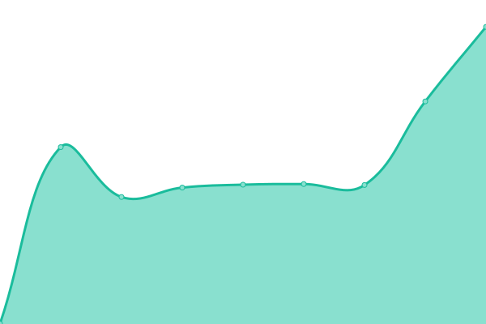
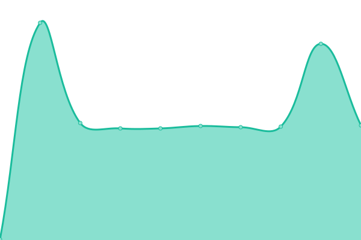
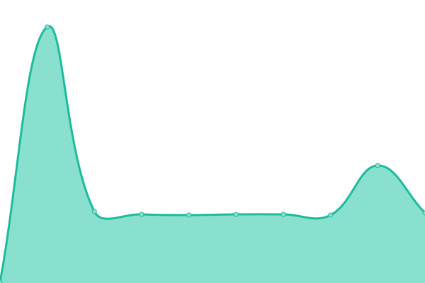
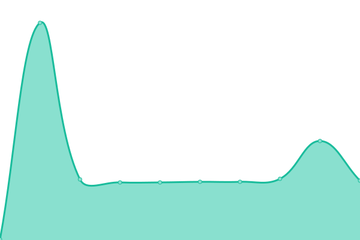
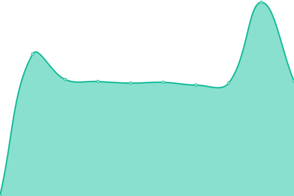
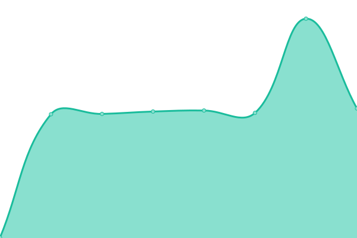

# [📈 Live Status](https://Grinnode-live.github.io/upptime): <!--live status--> **🟧 Partial outage**

This repository contains the open-source uptime monitor and status page for [Grinnode.live](https://grinnode.live/), powered by [Upptime](https://github.com/upptime/upptime).

With [Upptime](https://upptime.js.org), you can get your own unlimited and free uptime monitor and status page, powered entirely by a GitHub repository. We use [Issues](https://github.com/Grinnode-live/upptime/issues) as incident reports, [Actions](https://github.com/Grinnode-live/upptime/actions) as uptime monitors, and [Pages](https://Grinnode-live.github.io/upptime) for the status page.

<!--start: status pages-->
<!-- This summary is generated by Upptime (https://github.com/upptime/upptime) -->
<!-- Do not edit this manually, your changes will be overwritten -->
<!-- prettier-ignore -->
| URL | Status | History | Response Time | Uptime |
| --- | ------ | ------- | ------------- | ------ |
|  [Grinnode.live Website](https://grinnode.live/) | 🟩 Up | [grinnode-live-website.yml](https://github.com/Grinnode-live/upptime/commits/HEAD/history/grinnode-live-website.yml) | 

 521ms
     
 | 

<a href="https://Grinnode-live.github.io/upptime/history/grinnode-live-website">100.00%</a>
    

|  [peers API endpoint](https://grinnode.live:8080/healthcheck) | 🟩 Up | [peers-api-endpoint.yml](https://github.com/Grinnode-live/upptime/commits/HEAD/history/peers-api-endpoint.yml) | 

 474ms
     
 | 

<a href="https://Grinnode-live.github.io/upptime/history/peers-api-endpoint">100.00%</a>
    

|  [healthcheck API endpoint](https://grinnode.live:8080/peers) | 🟩 Up | [healthcheck-api-endpoint.yml](https://github.com/Grinnode-live/upptime/commits/HEAD/history/healthcheck-api-endpoint.yml) | 

 237ms
     
 | 

<a href="https://Grinnode-live.github.io/upptime/history/healthcheck-api-endpoint">100.00%</a>
    

|  [agents API endpoint](https://grinnode.live:8080/agents) | 🟩 Up | [agents-api-endpoint.yml](https://github.com/Grinnode-live/upptime/commits/HEAD/history/agents-api-endpoint.yml) | 

 123ms
     
 | 

<a href="https://Grinnode-live.github.io/upptime/history/agents-api-endpoint">100.00%</a>
    

|  [healthscore API endpoint](https://grinnode.live:8080/healthscore) | 🟩 Up | [healthscore-api-endpoint.yml](https://github.com/Grinnode-live/upptime/commits/HEAD/history/healthscore-api-endpoint.yml) | 

 122ms
     
 | 

<a href="https://Grinnode-live.github.io/upptime/history/healthscore-api-endpoint">100.00%</a>
    

|  [peerscountries API endpoint](https://grinnode.live:8080/peerscountries) | 🟩 Up | [peerscountries-api-endpoint.yml](https://github.com/Grinnode-live/upptime/commits/HEAD/history/peerscountries-api-endpoint.yml) | 

 122ms
     
 | 

<a href="https://Grinnode-live.github.io/upptime/history/peerscountries-api-endpoint">100.00%</a>
    

|  [walletcheck API endpoint](https://grinnode.live:8080/walletcheck/grin1zxwrf5yaxlyps4mpx3n7j9kp4su3gzgpdhfk2sgv56q0prcdlzls9e6e0y) | 🟥 Down | [walletcheck-api-endpoint.yml](https://github.com/Grinnode-live/upptime/commits/HEAD/history/walletcheck-api-endpoint.yml) | 

 6698ms
     
 | 

<a href="https://Grinnode-live.github.io/upptime/history/walletcheck-api-endpoint">89.50%</a>
    

|  [blockstats API endpoint](https://grinnode.live:8080/api/blockstats) | 🟩 Up | [blockstats-api-endpoint.yml](https://github.com/Grinnode-live/upptime/commits/HEAD/history/blockstats-api-endpoint.yml) | 

 163ms
     
 | 

<a href="https://Grinnode-live.github.io/upptime/history/blockstats-api-endpoint">100.00%</a>
    

|  [tx count API endpoint](https://grinnode.live:8080/api/txcounts) | 🟩 Up | [tx-count-api-endpoint.yml](https://github.com/Grinnode-live/upptime/commits/HEAD/history/tx-count-api-endpoint.yml) | 

 358ms
     
 | 

<a href="https://Grinnode-live.github.io/upptime/history/tx-count-api-endpoint">100.00%</a>
    

|  [Owner grinnode API endpoint](https://grinnode.live:3413/v2/owner) | 🟩 Up | [owner-grinnode-api-endpoint.yml](https://github.com/Grinnode-live/upptime/commits/HEAD/history/owner-grinnode-api-endpoint.yml) | 

 469ms
     
 | 

<a href="https://Grinnode-live.github.io/upptime/history/owner-grinnode-api-endpoint">100.00%</a>
    

<!--end: status pages-->

[**Visit our status website →**](https://Grinnode-live.github.io/upptime)

## 📄 License

- Powered by: [Upptime](https://github.com/upptime/upptime)
- Code: [MIT](./LICENSE) © [Grinnode.live](https://grinnode.live/)
- Data in the `./history` directory: [Open Database License](https://opendatacommons.org/licenses/odbl/1-0/)
